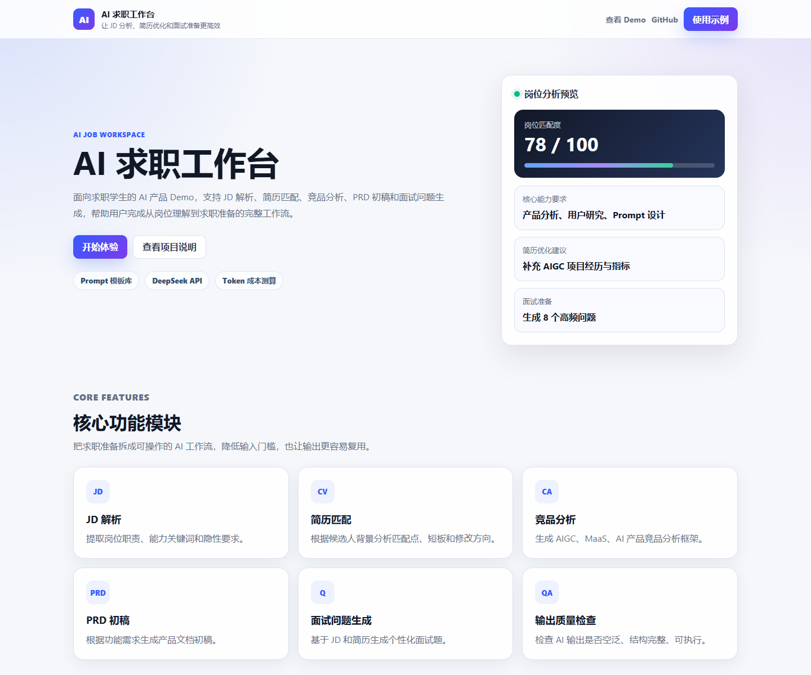

# AIGC 竞品分析与 AI 求职工作台 Demo

## 1. 项目定位

本项目是一个面向 **AI 产品经理实习岗位** 的 AIGC 产品作品集项目。

项目围绕豆包、Kimi、通义千问、即梦 AI、ChatGPT、Claude、Gemini 等国内外 AIGC 产品展开竞品分析，重点拆解 Prompt 引导、生成结果编辑、历史管理、多模态能力、工作流闭环和会员商业化策略。

在竞品分析和用户调研基础上，项目设计一个面向求职学生的 **AI 求职工作台 MVP**，帮助用户完成岗位 JD 解析、能力差距分析、简历表达改写、面试问题生成和投递项目管理。

本项目适合用于 AI 产品经理实习投递，重点展示 AIGC 竞品分析、用户需求洞察、AI 产品功能设计、PRD、低保真原型、大模型 API 接入 Demo、Token 成本测算和商业化思考。

## 2. 项目亮点

- **AIGC 竞品分析**：覆盖国内外主流 AI 产品，比较产品定位、交互、工作流和商业化。
- **用户需求洞察**：基于 7 位访谈对象，提炼求职、创作、办公、教育等场景痛点。
- **AI 求职工作台 MVP**：将泛创作助手收窄为更适合求职学生的 JD 分析和简历优化链路。
- **PRD 与低保真原型**：输出页面、字段、状态、异常、验收标准和页面线框。
- **大模型 API 接入 Demo**：使用 Node.js + Express + OpenAI SDK 调用 DeepSeek API。
- **Token 成本与商业化**：测算单次任务成本，设计免费版、学生版、专业版和团队版套餐。

## 3. 核心用户与场景

| 用户类型 | 核心任务 | 项目方案 |
|---|---|---|
| 求职学生 | 解析岗位 JD、准备简历和面试 | AI 求职工作台 MVP |
| AI 产品经理实习求职者 | 将作品集和经历转成岗位匹配表达 | JD 分析、能力差距、面试问题 |
| 数据分析 / 产品 / 运营方向求职者 | 拆解岗位能力、包装项目经历 | 能力关键词、简历改写建议 |
| 内容创作 / 教育 / 办公用户 | 后续扩展任务 | 放入 P1/P2 扩展场景 |

## 4. 项目结构

```text
ai-creator-workspace-product-case/
├── docs/          # 竞品分析、用户研究、产品报告、PRD、API 接入、商业化、AI 工作流案例
├── data/          # Token 成本测算表
├── demo/          # AI 求职工作台前端 Demo
├── server/        # Node.js + Express 后端接口
├── scripts/       # 批量 JD 分析等轻量自动化脚本
├── examples/      # 真实 JD 分析案例
├── prototype/     # 低保真原型设计
└── assets/        # 截图和素材
```

## 5. Demo 运行方式

Demo 演示讲解和验收清单见：[Demo Walkthrough](docs/demo-walkthrough.md)。



### 5.1 安装依赖

```bash
cd server
npm install
```

### 5.2 配置环境变量

在项目根目录复制 `.env.example` 为 `.env`：

```bash
copy .env.example .env
```

然后填写真实 Key：

```text
DEEPSEEK_API_KEY=your_deepseek_api_key_here
DEEPSEEK_MODEL=deepseek-v4-flash
PORT=3000
```

注意：不要提交真实 `.env` 文件，API Key 只在服务端读取。

### 5.3 启动服务

```bash
cd server
npm run dev
```

打开浏览器：

```text
http://localhost:3000
```

## 6. API 说明

接口：

```text
POST /api/analyze-jd
```

请求示例：

```json
{
  "targetRole": "AI 产品经理实习生",
  "jobDescription": "...",
  "userBackground": "...",
  "focusAreas": ["能力关键词", "简历改写建议", "面试问题"]
}
```

后端使用 OpenAI SDK 调用 DeepSeek OpenAI-compatible API，默认模型为 `deepseek-v4-flash`，可通过 `DEEPSEEK_MODEL` 调整。

## 7. 作品集展示路径

建议面试或投递时按以下顺序展示：

1. [国内外 AIGC 产品体验与产品策略对比](docs/domestic-vs-global-ai-products.md)
2. [AIGC 竞品分析](docs/competitor-analysis.md)
3. [用户研究](docs/user-research.md)
4. [产品方案报告](docs/product-report.md)
5. [PRD 初稿](docs/prd.md)
6. [低保真原型设计](prototype/low-fidelity-wireframes.md)
7. [Prompt 设计说明](docs/prompt-design.md)
8. [大模型 API 接入说明](docs/api-integration.md)
9. [AI 产品经理实习生 JD 分析案例](examples/ai-pm-intern-jd-case.md)
10. [Demo 演示讲解与验收清单](docs/demo-walkthrough.md)
11. [小米 AI 产品经理实习岗位匹配案例](docs/xiaomi-ai-workflow-case.md)
12. [Prompt 模板库](docs/prompt-template-library.md)
13. [商业化分析](docs/commercialization.md)
14. [作品集 PDF 大纲](docs/portfolio-pdf-outline.md)
15. [简历项目描述与面试讲述稿](docs/resume-and-interview.md)

## 8. 面试讲述重点

可以将项目讲成一条完整 AI 产品经理工作链路：

```text
国内外 AIGC 竞品分析
  -> 用户访谈和痛点洞察
  -> 收窄到 AI 求职工作台 MVP
  -> PRD 和低保真原型
  -> DeepSeek API Demo
  -> Token 成本测算和商业化设计
```

重点表达：

- 我不是只写了一个产品分析报告，而是把项目做成了能运行的 AI Demo。
- 我理解 AI 产品不仅要会设计功能，还要考虑 Prompt、API Key 安全、模型成本、输出结构和异常处理。
- 我将个人背景和求职目标结合，设计了适合 AI 产品经理实习投递的作品集项目。
- 面向小米这类 AI 工作流岗位，我进一步沉淀了 Prompt 模板库、SOP、质量评估标准和批量 JD 分析脚本。

## 9. 已完成产出

- [AIGC 竞品分析](docs/competitor-analysis.md)
- [国内外 AIGC 产品体验与产品策略对比](docs/domestic-vs-global-ai-products.md)
- [用户研究](docs/user-research.md)
- [迭代优先级](docs/iteration-plan.md)
- [产品方案报告](docs/product-report.md)
- [PRD 初稿](docs/prd.md)
- [低保真原型设计](prototype/low-fidelity-wireframes.md)
- [Prompt 设计说明](docs/prompt-design.md)
- [大模型 API 接入说明](docs/api-integration.md)
- [AI 产品经理实习生 JD 分析案例](examples/ai-pm-intern-jd-case.md)
- [Demo 演示讲解与验收清单](docs/demo-walkthrough.md)
- [小米 AI 产品经理实习岗位匹配案例](docs/xiaomi-ai-workflow-case.md)
- [Prompt 模板库](docs/prompt-template-library.md)
- [商业化分析](docs/commercialization.md)
- [作品集 PDF 大纲](docs/portfolio-pdf-outline.md)
- [简历项目描述与面试讲述稿](docs/resume-and-interview.md)
