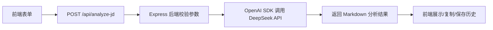

# 大模型 API 接入说明

## 1. 为什么要接入大模型

本项目是 AI 产品经理实习作品集项目，仅有产品方案、PRD 和原型还不足以体现 AI 产品落地能力。因此新增「AI 求职工作台 Demo」，通过真实大模型 API 完成岗位 JD 解析、能力差距分析、简历改写建议和面试问题生成。

接入大模型后，项目可以展示：

- Prompt 设计能力
- 前后端接口设计能力
- API Key 安全意识
- 大模型调用异常处理
- Token 成本和商业化意识

## 2. 为什么选择 DeepSeek API

DeepSeek API 支持 OpenAI 兼容调用格式，适合快速搭建 Demo。后端可以使用 OpenAI SDK，通过 `baseURL: "https://api.deepseek.com"` 调用 DeepSeek 模型。

本项目默认模型：

```text
DEEPSEEK_MODEL=deepseek-v4-flash
```

说明：真实模型可用性和价格应以 DeepSeek 官方文档和控制台为准。

## 3. 前后端调用流程



## 4. API Key 安全说明

- API Key 只保存在服务端 `.env` 文件中。
- 前端代码不包含 API Key。
- `.env` 已加入 `.gitignore`，不应提交到 GitHub。
- 仓库只提供 `.env.example` 作为配置示例。

## 5. 本地运行步骤

1. 安装依赖：

```bash
cd server
npm install
```

2. 在项目根目录复制环境变量文件：

```bash
copy .env.example .env
```

3. 修改 `.env`：

```text
DEEPSEEK_API_KEY=你的真实 API Key
DEEPSEEK_MODEL=deepseek-v4-flash
PORT=3000
```

4. 启动服务：

```bash
cd server
npm run dev
```

5. 打开 Demo：

```text
http://localhost:3000
```

## 6. 常见问题

| 问题 | 可能原因 | 解决方式 |
|---|---|---|
| 服务端提示没有 API Key | 未创建 `.env` 或变量名错误 | 检查 `DEEPSEEK_API_KEY` |
| 前端请求失败 | 服务未启动或端口不对 | 确认 `npm run dev` 已启动 |
| 模型请求失败 | Key 无效、余额不足、模型不可用 | 检查 DeepSeek 控制台和模型配置 |
| 返回内容为空 | 模型响应异常或输入过短 | 重试或补充 JD 和个人背景 |
| 复制按钮不可用 | 浏览器权限限制 | 使用现代浏览器并允许剪贴板权限 |

## 7. 后续可扩展方向

- 接入 OpenAI
- 接入 Kimi
- 增加模型切换
- 增加 Token 统计
- 增加真实用户测试记录
- 支持上传简历文件
- 将本地历史记录升级为后端项目管理
