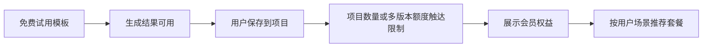

# 商业化分析

## 1. 分析目标

本文件用于评估「AI 创作助手工作台」MVP 的 Token 成本、免费额度策略、会员套餐设计和付费转化逻辑。

本部分希望回答三个问题：

- 用户每完成一次典型任务，大概消耗多少 Token 成本？
- 如果提供免费版和会员版，额度应该如何设计才相对合理？
- 对 AI 产品经理作品集而言，如何体现成本意识、商业化判断和产品取舍？

## 2. 测算口径

### 2.1 基础假设

| 项目 | 假设 |
|---|---|
| 产品阶段 | MVP，文本生成为主 |
| 核心场景 | JD 解析、简历润色、视频脚本、运营方案、会议纪要 |
| 成本范围 | 仅估算模型 Token 成本，不包含服务器、存储、带宽、支付通道、运营和人工审核成本 |
| 汇率假设 | 1 USD = 7.2 RMB，仅用于作品集估算，不代表实时汇率 |
| 安全系数 | 单次成本按 raw cost * 2.5 估算，用于覆盖系统 Prompt、上下文、重试、失败请求和一定冗余 |

### 2.2 模型价格参考

本项目不绑定具体模型，商业化测算采用“低成本文本模型 + 高质量模型备选”的思路。为了让作品集体现更完整的成本意识，`data/token-cost-model.csv` 已补充项目中涉及的主要 AI 产品和可公开查询的 API 价格参考。

| 模型参考 | 输入价格 | 输出价格 | 币种 | 适用定位 |
|---|---:|---:|---|---|
| DeepSeek v4-flash | 0.14 / 1M tokens | 0.28 / 1M tokens | USD | Demo 默认低成本模型 |
| DeepSeek v4-pro | 0.435 / 1M tokens | 0.87 / 1M tokens | USD | DeepSeek 高质量备选 |
| OpenAI GPT-5.4 mini | 0.75 / 1M tokens | 4.50 / 1M tokens | USD | ChatGPT / OpenAI 成本参考 |
| OpenAI GPT-5.4 | 2.50 / 1M tokens | 15.00 / 1M tokens | USD | 高质量国际模型参考 |
| Claude Haiku 4.5 | 1.00 / 1M tokens | 5.00 / 1M tokens | USD | Claude 低成本参考 |
| Claude Sonnet 4.6 | 3.00 / 1M tokens | 15.00 / 1M tokens | USD | Claude 高质量写作和长文参考 |
| Gemini 2.5 Flash-Lite | 0.10 / 1M tokens | 0.40 / 1M tokens | USD | Gemini 低成本参考 |
| Gemini 2.5 Flash | 0.30 / 1M tokens | 2.50 / 1M tokens | USD | Gemini 综合能力参考 |
| Gemini 2.5 Pro | 1.25 / 1M tokens | 10.00 / 1M tokens | USD | Gemini 高质量参考，按 <= 200k prompts 口径 |
| Kimi moonshot-v1-32k | 1.00 / 1M tokens | 3.00 / 1M tokens | USD | Kimi 长文本参考 |
| Kimi K2.5 | 0.60 / 1M tokens | 3.00 / 1M tokens | USD | Kimi 多模态和长上下文参考，按 cache miss 口径 |
| 通义千问 Qwen3.5-Plus | 0.115 / 1M tokens | 0.688 / 1M tokens | USD | 国内综合模型参考，按中国内地最低价口径 |
| 通义千问 Qwen3-Max | 0.359 / 1M tokens | 1.434 / 1M tokens | USD | 国内高质量模型参考，按中国内地最低价口径 |
| 豆包 1.5 Lite 32k | 0.30 / 1M tokens | 0.60 / 1M tokens | RMB | 国内低成本文本模型参考 |
| 豆包 1.5 Pro 32k | 0.80 / 1M tokens | 2.00 / 1M tokens | RMB | 国内通用文本模型参考 |

价格来源：

- DeepSeek API Pricing：https://api-docs.deepseek.com/quick_start/pricing
- OpenAI API Pricing：https://openai.com/api/pricing/
- Anthropic Claude Pricing：https://www.anthropic.com/pricing
- Google Gemini API Pricing：https://ai.google.dev/gemini-api/docs/pricing
- Moonshot Kimi Pricing：https://platform.kimi.ai/docs/pricing/chat-v1
- Moonshot Kimi K2.5 Pricing：https://platform.kimi.ai/docs/pricing/chat-k25
- Alibaba Cloud Model Studio Pricing：https://www.alibabacloud.com/help/en/model-studio/models
- Volcengine Ark Pricing：https://www.volcengine.com/docs/82379/1099320

说明：真实 API 价格应以模型厂商当前价格页为准。部分模型存在缓存命中、长上下文、思考模式、阶梯价、区域价和批量折扣，本文统一采用公开页中最容易复算的标准输入/输出 token 价格。即梦 AI 等视觉生成产品通常按图片、视频、点数或生成次数计费，不适合直接放入文本 token 成本表，后续如扩展视觉生成场景，应单独建立图片/视频生成成本表。

## 3. 单次任务 Token 成本测算

以 DeepSeek API 公开价格作为低成本基准，按 1 USD = 7.2 RMB 估算。

| 任务类型 | 典型场景 | 输入 tokens | 输出 tokens | raw cost/RMB | 加安全系数后/RMB |
|---|---|---:|---:|---:|---:|
| 轻量任务 | 标题、短文案、单段改写 | 800 | 600 | 0.0020 | 0.0050 |
| 标准任务 | JD 解析、简历润色、会议纪要 | 2,000 | 1,200 | 0.0044 | 0.0111 |
| 重度任务 | 长材料总结、运营方案、深度岗位分析 | 5,000 | 3,000 | 0.0111 | 0.0277 |
| 多版本任务 | 一次生成 3 个版本脚本/简历表达 | 2,500 | 3,600 | 0.0098 | 0.0244 |

### 3.1 结论

从 Token 成本看，纯文本 MVP 的单次模型成本较低，真正影响商业化的不是单次调用成本，而是：

- 高频用户的累计生成次数
- 多版本生成带来的输出 Token 增长
- 是否引入更贵的高质量模型
- 长上下文、历史项目引用和资料上传带来的输入 Token 增长
- 免费用户是否大量消耗额度但不转化

因此，套餐设计不应只按“次数”售卖，而应把高级模板、项目管理、多版本生成、专业核验和导出能力一起打包。

## 4. 用户月度用量假设

| 用户类型 | 使用特征 | 月度任务假设 | 估算模型成本/RMB |
|---|---|---|---:|
| 轻度免费用户 | 偶尔试用模板 | 50 次轻量 + 20 次标准 + 5 次多版本 | 约 0.60 |
| 求职学生 | 求职阶段集中使用 | 300 次标准 + 100 次多版本 + 30 次重度 | 约 6.60 |
| 内容创作者 | 高频脚本、标题、多版本 | 800 次标准 + 300 次多版本 + 100 次重度 | 约 18.97 |
| 小团队/重度办公 | 多项目、多成员、多文档 | 2,500 次标准 + 800 次多版本 + 300 次重度 | 约 55.60 |

说明：上述成本已使用 2.5 倍安全系数，但仍只覆盖模型 Token 成本。

## 5. 套餐设计建议

### 5.1 免费版

目标：降低试用门槛，让用户体验“模板 + 改写 + 保存”的核心价值。

| 权益 | 设计 |
|---|---|
| 基础模板 | JD 解析、简历润色、视频脚本、运营方案、会议纪要 |
| 月度额度 | 50 次轻量任务 + 20 次标准任务 |
| 多版本生成 | 每月 5 次 |
| 项目保存 | 最多 3 个项目 |
| 导出 | 支持复制和 Markdown 导出 |
| 限制 | 不支持批量生成、高级模板、深度历史搜索 |

设计理由：

- 免费额度足够完成一次真实体验，但不足以覆盖长期高频使用。
- 项目数量限制能引导重度用户升级。
- 多版本生成保留少量免费体验，让用户感知会员价值。

### 5.2 学生求职版

建议价格：19 元/月。

| 权益 | 设计 |
|---|---|
| 适用用户 | 求职学生、实习准备用户 |
| 月度额度 | 300 次标准任务 + 100 次多版本任务 + 30 次重度任务 |
| 高级模板 | JD 解析链路、简历项目经历改写、面试问题生成 |
| 项目管理 | 最多 20 个求职项目 |
| 导出 | Markdown / Word 文案复制 |
| 付费理由 | 帮助学生围绕不同公司和岗位快速生成求职材料 |

商业判断：

- 对学生群体价格不能过高，19 元/月更容易接受。
- 成本估算约 6.60 元/月，仍有空间覆盖其他基础成本。
- 适合在求职季作为短周期订阅。

### 5.3 创作者/办公专业版

建议价格：39 元/月。

| 权益 | 设计 |
|---|---|
| 适用用户 | 内容创作者、新媒体运营、职场办公用户 |
| 月度额度 | 800 次标准任务 + 300 次多版本任务 + 100 次重度任务 |
| 高级模板 | 视频脚本、账号风格、运营方案、会议纪要、汇报材料 |
| 项目管理 | 最多 100 个项目，支持标签和历史搜索 |
| 多版本能力 | 支持批量生成标题、脚本和文案版本 |
| 付费理由 | 节省高频创作和办公产出时间 |

商业判断：

- 高频用户愿意为效率和稳定风格付费。
- 成本估算约 18.97 元/月，模型成本占价格约 49%。
- 如果引入更贵模型，需要对高质量模型调用做额度限制或分层。

### 5.4 小团队版

建议价格：99 元/月起。

| 权益 | 设计 |
|---|---|
| 适用用户 | 小型运营团队、内容团队 |
| 月度额度 | 2,500 次标准任务 + 800 次多版本任务 + 300 次重度任务 |
| 协作能力 | 项目共享、模板共享、成员权限 |
| 项目管理 | 更多项目空间和历史搜索 |
| 数据能力 | 后续可加入模板使用统计和内容产出统计 |
| 付费理由 | 支持多人复用模板和项目资产 |

商业判断：

- 团队版不应只卖 Token，应重点卖协作、模板资产和项目沉淀。
- 成本估算约 55.60 元/月，毛利空间取决于团队使用强度。
- 上线初期建议限制成员数和高质量模型调用次数。

## 6. 会员权益分层逻辑

| 能力 | 免费版 | 学生求职版 | 创作者/办公专业版 | 小团队版 |
|---|---|---|---|---|
| 基础模板 | 支持 | 支持 | 支持 | 支持 |
| 高级模板 | 不支持 | 求职模板 | 创作/办公模板 | 团队模板 |
| 多版本生成 | 少量体验 | 中等额度 | 高频额度 | 团队额度 |
| 项目数量 | 3 个 | 20 个 | 100 个 | 更多项目 |
| 历史搜索 | 基础 | 基础 | 高级搜索 | 团队搜索 |
| 专业内容核验提示 | 基础提示 | 基础提示 | 增强提示 | 增强提示 |
| 团队协作 | 不支持 | 不支持 | 不支持 | 支持 |

## 7. 付费转化路径

### 7.1 关键转化点

| 转化点 | 触发场景 | 推荐策略 |
|---|---|---|
| 多版本额度用完 | 用户频繁生成多个标题/脚本/简历版本 | 推荐专业版或学生求职版 |
| 项目数量达到上限 | 用户保存多个岗位、账号或运营项目 | 推荐升级项目空间 |
| 使用高级模板 | 用户点击 JD 解析链路、账号风格模板 | 展示模板价值和示例输出 |
| 导出高级格式 | 用户想导出 Word/PDF/PPT 文案 | 引导会员导出权益 |

## 8. 风险与控制策略

| 风险 | 影响 | 控制策略 |
|---|---|---|
| 免费额度被大量消耗 | 增加成本但不转化 | 设置月度额度、频控和注册限制 |
| 多版本生成输出过长 | 输出 Token 成本上升 | 限制单次版本数和最大输出长度 |
| 长文档输入成本高 | 输入 Token 快速增长 | 对长文档总结单独设额度 |
| 高质量模型成本高 | 毛利被压缩 | 高质量模型仅对会员开放，并设置调用次数 |
| 专业内容错误 | 影响用户信任 | 增加核验提示、来源要求和人工确认入口 |

## 8.1 Demo 阶段成本控制策略

AI 求职工作台 Demo 面向作品集展示，不应开放成无限调用的公开服务。Demo 阶段建议采用以下控制策略：

| 策略 | 说明 |
|---|---|
| 限制单次输入长度 | 前后端限制岗位 JD 和个人背景长度，避免一次请求消耗过多输入 Token |
| 限制输出长度 | 后端设置 `max_tokens`，控制单次输出成本 |
| 不保存用户隐私数据 | 前端仅用 localStorage 保存本地历史，不上传简历、手机号、邮箱等敏感信息 |
| 不开放公开无限调用 | Demo 仅用于本地运行或受控展示，避免 API Key 被间接滥用 |
| 后续增加 Token 统计 | 记录每次请求 usage，估算单次成本和高频使用成本 |
| 模型可配置 | 使用 `DEEPSEEK_MODEL` 环境变量，默认 `deepseek-v4-flash`，后续可切换到更高质量模型 |

## 9. 作品集呈现建议

在作品集 PDF 中，这部分不需要展示所有计算细节，建议浓缩成 1-2 页：

1. 放一张“单次任务成本测算表”，体现你理解 AI 产品的 Token 成本结构。
2. 放一张“免费版 / 学生版 / 专业版 / 团队版套餐表”，体现你能从用户价值设计商业化。
3. 用一句话总结商业判断：纯文本 MVP 的单次 Token 成本不高，付费点应围绕高级模板、多版本、项目管理和专业能力，而不是只卖生成次数。

## 10. 结论

AI 创作助手工作台的商业化重点不应是简单售卖 Token 次数，而应围绕“让用户更快完成真实任务”设计权益。

对求职学生，付费价值来自岗位解析、简历改写和面试准备链路；对内容创作者和运营用户，付费价值来自多版本生成、账号风格和项目复用；对团队用户，付费价值来自模板共享、项目协作和历史资产沉淀。

在 MVP 阶段，建议采用免费版降低试用门槛，用 19 元学生求职版和 39 元专业版验证个人用户付费意愿，再将团队版作为 P2 阶段商业化扩展方向。
