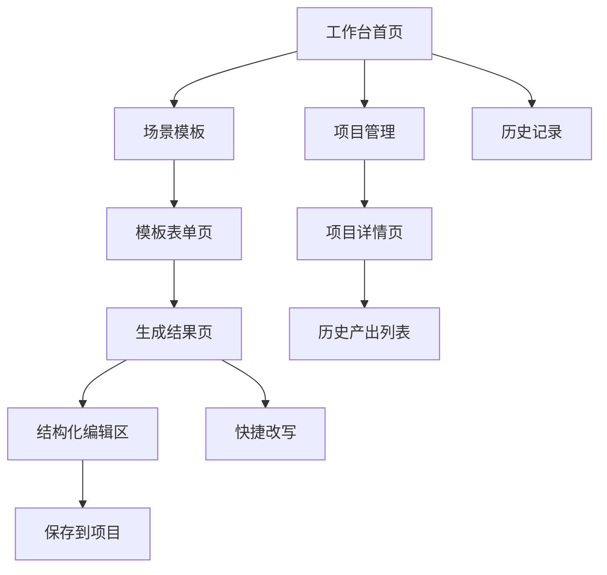

# AI 创作助手工作台 PRD

## 1. 文档说明

本文档为「AI 创作助手工作台」MVP 版本产品需求文档，用于把前期竞品分析、用户研究、痛点整理和产品方案转化为可执行的功能需求。

| 项目 | 内容 |
|---|---|
| 产品名称 | AI 创作助手工作台 |
| 文档版本 | V1.0 |
| 目标版本 | MVP |
| 目标岗位展示 | AI 产品经理实习作品集项目 |
| 核心场景 | 求职、内容创作、运营办公 |
| 扩展场景 | 专业办公、教育讲解、家庭辅导 |

## 2. 需求背景

用户使用通用 AI 工具进行创作时，常见流程是：打开聊天框、自己写 Prompt、复制生成结果、到其他工具中修改、手动保存历史内容。这个流程存在三个主要问题：

- 输入门槛高：用户不知道如何描述任务背景、输出格式和风格要求。
- 结果难交付：AI 输出常停留在第一版，需要反复追问和人工改写。
- 内容难复用：历史记录按对话保存，难以按岗位、账号、项目或章节沉淀。

MVP 版本希望先解决“低门槛输入 + 可修改结果 + 可保存复用”三件事，让产品区别于单纯聊天式 AI 助手。

## 3. 产品目标

### 3.1 用户目标

- 用户能从场景模板开始任务，不必从空白 Prompt 开始。
- 用户能对 AI 结果进行快捷改写和多版本生成。
- 用户能在结构化编辑区整理内容，而不是只复制聊天结果。
- 用户能把内容保存到项目中，方便后续复用。

### 3.2 业务目标

- 提升首次使用成功率：用户进入产品后能快速完成一次有效生成。
- 提升结果采纳率：生成结果能够被复制、保存、导出或继续编辑。
- 提升留存基础：用户愿意把项目和历史内容沉淀在产品中。
- 为后续会员体系提供功能基础：高级模板、批量生成、项目容量和专业核验。

## 4. 目标用户

| 用户类型 | 核心任务 | MVP 支持方式 |
|---|---|---|
| 求职学生 | JD 分析、简历润色、面试准备 | 提供岗位 JD 解析和简历润色模板 |
| 内容创作者 | 视频脚本、标题、标签、发布文案 | 提供视频脚本模板和多版本生成 |
| 运营/职场用户 | 运营方案、会议纪要、汇报材料 | 提供运营方案和会议纪要模板 |
| 专业/教育用户 | 资料总结、教学讲解、错题分析 | MVP 只提供轻量核验提示，完整模板放入 P1 |

## 5. MVP 功能范围

### 5.1 本期包含

| 模块 | 功能 | 优先级 |
|---|---|---|
| 工作台首页 | 场景模板入口、最近项目、最近生成记录 | P0 |
| 场景模板 | 岗位 JD 解析、简历润色、视频脚本、运营方案、会议纪要 | P0 |
| 表单化输入 | 根据模板填写背景、目标、风格和输出格式 | P0 |
| AI 生成 | 根据用户输入生成结构化结果 | P0 |
| 快捷改写 | 更专业、更口语化、改短、扩写、多版本生成 | P0 |
| 结构化编辑区 | 展示和编辑 AI 输出内容 | P0 |
| 项目保存 | 保存结果到项目，支持项目列表和搜索 | P0 |
| 核验提示 | 对专业/教育类内容显示人工核验提醒 | P1 |

### 5.2 本期不包含

| 功能 | 后置原因 |
|---|---|
| 团队协作 | MVP 先验证个人工作流 |
| 完整视觉编辑器 | 实现复杂度高，不是当前核心链路 |
| 全学科题库 | 教育场景需进一步验证 |
| 行业数据库 | 需要外部数据源和合规评估 |
| 数据看板 | 需要产品上线后的行为数据支撑 |

## 6. 信息架构

## 7. 核心用户流程

### 7.1 通用生成流程

### 7.2 岗位 JD 解析流程

1. 用户进入工作台首页。
2. 点击“岗位 JD 解析”模板。
3. 粘贴岗位 JD，填写目标岗位、已有经历、求职方向和输出偏好。
4. 点击“生成分析”。
5. 系统输出岗位关键词、能力要求、能力差距、简历改写建议和面试问题。
6. 用户点击“生成简历版本”或“更专业”进行二次加工。
7. 用户保存到对应求职项目。

## 8. 页面需求

### 8.1 工作台首页

页面目标：让用户快速进入高频场景，并看到最近项目和历史产出。

核心元素：

| 区域 | 内容 | 规则 |
|---|---|---|
| 顶部导航 | 产品名称、搜索、会员入口、个人入口 | 搜索支持模板和项目关键词 |
| 场景模板区 | JD 解析、简历润色、视频脚本、运营方案、会议纪要 | 模板按使用频率排序 |
| 最近项目区 | 展示最近 5 个项目 | 点击进入项目详情 |
| 最近生成区 | 展示最近 5 条生成记录 | 点击进入结果详情 |

空状态：

- 无项目时，显示“创建第一个项目”按钮。
- 无生成记录时，显示推荐模板入口。

### 8.2 场景模板表单页

页面目标：通过表单降低 Prompt 输入门槛。

通用字段：

| 字段 | 类型 | 是否必填 | 说明 |
|---|---|---|---|
| 任务目标 | 单行输入 | 是 | 用户希望 AI 完成的具体任务 |
| 背景信息 | 多行输入 | 是 | 岗位、账号、业务、材料或用户情况 |
| 输出格式 | 下拉选择 | 是 | 清单、表格、正文、脚本、方案 |
| 风格要求 | 多选标签 | 否 | 专业、口语化、有网感、正式、简洁 |
| 补充要求 | 多行输入 | 否 | 用户的额外限制或偏好 |

按钮规则：

- 必填字段未填写时，“生成”按钮置灰。
- 点击生成后按钮进入 loading 状态，文案变为“生成中”。
- 生成失败时显示错误提示，并保留用户已填写内容。

### 8.3 生成结果页

页面目标：展示 AI 输出，并提供二次加工入口。

核心元素：

| 区域 | 内容 | 规则 |
|---|---|---|
| 结果标题 | 本次任务名称和模板类型 | 支持用户重命名 |
| 结构化结果 | 按模块展示生成内容 | 不同模板展示不同结构 |
| 快捷操作 | 更专业、更口语化、改短、扩写、多版本 | 点击后基于当前内容再次生成 |
| 核验提示 | 专业/教育内容风险提醒 | 仅在相关模板或关键词触发 |
| 保存按钮 | 保存到项目 | 未选择项目时弹出项目选择框 |
| 导出按钮 | 复制、导出 Markdown | MVP 先支持复制和 Markdown |

### 8.4 结构化编辑区

页面目标：让用户直接整理 AI 输出内容。

功能规则：

- 每个结构化模块都支持单独编辑。
- 用户可以对单个模块执行快捷改写。
- 支持新增、删除、调整模块顺序。
- 编辑后自动标记为“已修改”。
- 离开页面前如果有未保存内容，提示用户保存。

### 8.5 项目管理页

页面目标：让历史内容按项目沉淀，方便复用。

项目字段：

| 字段 | 说明 |
|---|---|
| 项目名称 | 例如“字节产品实习投递”“游戏账号脚本库” |
| 项目类型 | 求职、内容创作、运营办公、教育辅导、其他 |
| 标签 | 用户自定义标签 |
| 最近更新时间 | 系统自动记录 |
| 项目内容 | 保存过的生成结果和编辑版本 |

功能规则：

- 支持创建、重命名、删除项目。
- 支持按项目类型和标签筛选。
- 支持按关键词搜索项目和历史产出。
- 删除项目时需二次确认。

## 9. 关键模板需求

### 9.1 岗位 JD 解析模板

输入字段：

| 字段 | 是否必填 | 示例 |
|---|---|---|
| 岗位 JD | 是 | 粘贴招聘信息 |
| 目标岗位 | 是 | AI 产品经理实习生 |
| 用户背景 | 是 | 应用统计研一，做过数据分析项目 |
| 输出重点 | 否 | 简历优化、能力差距、面试问题 |

输出结构：

- 岗位核心职责
- 能力关键词
- 用户已有优势
- 能力差距
- 简历改写建议
- 面试准备问题

### 9.2 视频脚本模板

输入字段：

| 字段 | 是否必填 | 示例 |
|---|---|---|
| 平台 | 是 | 抖音、小红书、B 站 |
| 账号定位 | 是 | 游戏主播、新媒体运营 |
| 选题 | 是 | 新版本游戏更新吐槽 |
| 风格 | 否 | 有网感、轻松、犀利 |

输出结构：

- 选题标题
- 开头钩子
- 脚本正文
- 互动话术
- 标题备选
- 标签建议

### 9.3 运营方案模板

输入字段：

| 字段 | 是否必填 | 示例 |
|---|---|---|
| 业务背景 | 是 | 某产品新用户增长 |
| 活动目标 | 是 | 提升注册转化 |
| 目标用户 | 是 | 大学生用户 |
| 资源限制 | 否 | 预算、人力、周期 |

输出结构：

- 背景理解
- 目标拆解
- 核心策略
- 执行步骤
- 风险点
- 数据指标

## 10. 状态与异常

| 场景 | 处理规则 |
|---|---|
| 必填字段为空 | 生成按钮置灰，字段下方提示“请补充该信息” |
| 生成超时 | 显示“生成时间较长，请稍后重试”，保留表单内容 |
| 生成失败 | 显示失败原因和“重新生成”按钮 |
| 内容未保存离开 | 弹出确认提示 |
| 删除项目 | 二次确认，提示删除后不可恢复 |
| 专业/教育内容 | 显示“AI 输出仅供参考，建议结合来源或教材核验” |

## 11. 埋点指标

| 指标 | 触发时机 | 用途 |
|---|---|---|
| template_view | 用户看到模板入口 | 判断模板曝光 |
| template_click | 用户点击模板 | 判断模板吸引力 |
| generation_submit | 用户点击生成 | 判断任务提交量 |
| generation_success | 生成成功 | 判断生成链路稳定性 |
| quick_edit_click | 用户点击快捷改写 | 判断二次加工需求 |
| version_generate | 用户生成多版本 | 判断多版本功能价值 |
| result_save | 用户保存结果 | 判断结果采纳率 |
| project_create | 用户创建项目 | 判断项目管理需求 |
| export_click | 用户复制或导出 | 判断交付行为 |

## 12. 验收标准

| 功能 | 验收标准 |
|---|---|
| 场景模板入口 | 首页能展示 5 个 MVP 模板，并可点击进入表单页 |
| 表单化输入 | 必填项为空时不能提交，填写后可正常生成 |
| AI 生成结果 | 每个模板能输出对应结构化模块 |
| 快捷改写 | 用户可对整篇或单个模块执行改写 |
| 多版本生成 | 用户可一次生成多个版本并进行查看 |
| 编辑区 | 用户可编辑、调整并保存生成内容 |
| 项目保存 | 用户可创建项目，并把生成结果保存进去 |
| 搜索 | 用户可按关键词搜索项目和历史内容 |
| 核验提示 | 专业/教育相关模板会显示人工核验提醒 |

## 13. 后续迭代

P1 重点：

- 岗位 JD 解析完整链路
- 账号风格模板
- 更完整的项目化历史管理
- 教育讲解与错题模板
- 专业/教育核验提示增强

P2 重点：

- 视觉/课件辅助生成
- 团队协作与模板共享
- 数据看板与效果追踪
- 会员权益体系细化

## 14. 项目展示价值

这份 PRD 在求职作品集中主要体现以下能力：

- 能从用户痛点拆解到产品功能
- 能区分 P0/P1/P2 范围，体现产品取舍
- 能设计页面、字段、状态、异常和验收标准
- 能结合 AI 产品特点考虑 Prompt 模板、结果编辑、核验提示和埋点指标
- 能把研究型文档转化为可落地执行的产品需求
