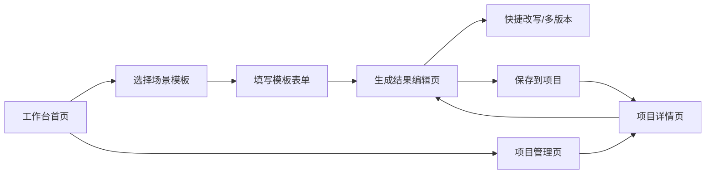

# 低保真原型设计

## 1. 原型目标

本原型用于展示「AI 创作助手工作台」MVP 的核心页面结构和用户操作路径，重点验证以下问题：

- 用户能否从首页快速找到适合自己的场景模板
- 用户能否通过表单化输入完成高质量 Prompt
- AI 生成结果是否能在页面内继续编辑和改写
- 历史内容是否能按项目保存和复用
- 产品形态是否区别于普通聊天式 AI 工具

本阶段为低保真页面结构，不追求视觉细节，重点表达信息架构、页面模块和关键交互。

## 2. 原型范围

| 页面 | 对应 PRD 模块 | 设计目标 |
|---|---|---|
| 工作台首页 | 工作台首页、场景模板入口、最近项目 | 让用户快速进入高频任务 |
| 场景模板表单页 | 表单化输入、AI 生成 | 降低 Prompt 输入门槛 |
| 生成结果编辑页 | 结构化结果、快捷改写、多版本生成 | 让 AI 输出从第一版走向可交付 |
| 项目管理页 | 项目保存、历史搜索 | 支持内容沉淀和复用 |
| 项目详情页 | 历史产出列表、版本管理 | 按项目查看和继续加工历史内容 |
| 会员权益页 | 商业化与会员能力 | 展示后续付费点，不作为 MVP 核心链路 |

## 3. 核心页面流转



## 4. 页面 1：工作台首页

### 4.1 页面目标

首页要解决“用户一进来不知道该问什么”的问题，因此重点展示高频场景入口，而不是把聊天框作为唯一入口。

### 4.2 页面结构

```text
┌──────────────────────────────────────────────────────────────┐
│ AI 创作助手工作台                  搜索模板/项目     会员  头像 │
├──────────────────────────────────────────────────────────────┤
│ 快速开始                                                     │
│ ┌──────────┐ ┌──────────┐ ┌──────────┐ ┌──────────┐ ┌──────────┐ │
│ │ JD 解析   │ │ 简历润色  │ │ 视频脚本  │ │ 运营方案  │ │ 会议纪要  │ │
│ │ 求职准备  │ │ 求职表达  │ │ 内容创作  │ │ 办公方案  │ │ 办公整理  │ │
│ └──────────┘ └──────────┘ └──────────┘ └──────────┘ └──────────┘ │
│                                                              │
│ 最近项目                                      查看全部         │
│ ┌────────────────┐ ┌────────────────┐ ┌────────────────┐       │
│ │ 字节产品实习投递 │ │ 游戏账号脚本库  │ │ 运营活动方案    │       │
│ │ 3 条内容        │ │ 12 条内容       │ │ 5 条内容        │       │
│ └────────────────┘ └────────────────┘ └────────────────┘       │
│                                                              │
│ 最近生成                                      查看历史         │
│ ┌──────────────────────────────────────────────────────────┐ │
│ │ JD 解析：AI 产品经理实习生             5 分钟前           │ │
│ │ 视频脚本：版本更新吐槽                 昨天               │ │
│ │ 会议纪要：活动复盘会                   2 天前             │ │
│ └──────────────────────────────────────────────────────────┘ │
└──────────────────────────────────────────────────────────────┘
```

### 4.3 关键交互

- 点击任一模板卡片，进入对应模板表单页。
- 搜索框支持搜索模板、项目和历史生成内容。
- 点击最近项目卡片，进入项目详情页。
- 最近生成记录点击后进入对应生成结果编辑页。

### 4.4 状态说明

| 状态 | 页面表现 |
|---|---|
| 新用户无项目 | 最近项目区显示“创建第一个项目”入口 |
| 无历史生成 | 最近生成区展示推荐模板 |
| 搜索无结果 | 提示“没有找到相关模板或项目” |

## 5. 页面 2：场景模板表单页

### 5.1 页面目标

把用户模糊需求拆成结构化字段，降低 Prompt 编写门槛。这里以“岗位 JD 解析”为示例。

### 5.2 页面结构

```text
┌──────────────────────────────────────────────────────────────┐
│ ← 返回工作台       岗位 JD 解析                              │
├──────────────────────────────────────────────────────────────┤
│ 左侧：输入表单                         右侧：模板说明          │
│ ┌──────────────────────────────┐      ┌────────────────────┐ │
│ │ 岗位 JD *                    │      │ 本模板会输出：       │ │
│ │ ┌──────────────────────────┐ │      │ - 岗位核心职责       │ │
│ │ │ 粘贴招聘信息...           │ │      │ - 能力关键词         │ │
│ │ └──────────────────────────┘ │      │ - 能力差距           │ │
│ │                              │      │ - 简历改写建议       │ │
│ │ 目标岗位 *                   │      │ - 面试准备问题       │ │
│ │ [AI 产品经理实习生        ]  │      └────────────────────┘ │
│ │                              │                              │
│ │ 用户背景 *                   │                              │
│ │ [西安交通大学应用统计研一...] │                              │
│ │                              │                              │
│ │ 输出重点                     │                              │
│ │ [x] 简历优化  [x] 能力差距   │                              │
│ │ [x] 面试问题  [ ] 学习路径   │                              │
│ │                              │                              │
│ │ 风格要求                     │                              │
│ │ [专业] [简洁] [适合校招生]   │                              │
│ │                              │                              │
│ │           [生成分析]          │                              │
│ └──────────────────────────────┘                              │
└──────────────────────────────────────────────────────────────┘
```

### 5.3 字段规则

| 字段 | 规则 |
|---|---|
| 岗位 JD | 必填，建议不少于 50 字 |
| 目标岗位 | 必填，用于控制输出语境 |
| 用户背景 | 必填，用于匹配能力差距和简历建议 |
| 输出重点 | 至少选择 1 项 |
| 风格要求 | 非必填，默认“专业、清晰” |

### 5.4 关键交互

- 必填项为空时，“生成分析”按钮置灰。
- 点击生成后进入 loading 状态，按钮文案变为“生成中”。
- 生成成功后进入生成结果编辑页。
- 生成失败时保留表单内容，并显示“重新生成”。

## 6. 页面 3：生成结果编辑页

### 6.1 页面目标

这是 MVP 的核心页面。用户在这里完成“查看结果、二次改写、编辑整理、保存项目、导出使用”。

### 6.2 页面结构

```text
┌──────────────────────────────────────────────────────────────┐
│ ← 返回        JD 解析：AI 产品经理实习生      保存到项目  导出 │
├──────────────────────────────────────────────────────────────┤
│ 快捷操作： [更专业] [更简洁] [生成 3 个版本] [转简历表达]       │
├──────────────────────────────────────────────────────────────┤
│ 左侧：结构化结果                         右侧：版本/提示       │
│ ┌──────────────────────────────┐      ┌────────────────────┐ │
│ │ 1. 岗位核心职责               │      │ 版本记录            │ │
│ │ ┌──────────────────────────┐ │      │ - 初始版本          │ │
│ │ │ 负责 AI 产品需求分析...    │ │      │ - 更专业版本        │ │
│ │ └──────────────────────────┘ │      │ - 简历表达版本      │ │
│ │ [单独改写] [复制]            │      │                    │ │
│ │                              │      │ 核验提示            │ │
│ │ 2. 能力关键词                 │      │ 专业判断需结合真实   │ │
│ │ ┌──────────────────────────┐ │      │ 招聘信息和个人经历。 │ │
│ │ │ 用户研究 / Prompt / 数据...│ │      └────────────────────┘ │
│ │ └──────────────────────────┘ │                              │
│ │ [单独改写] [复制]            │                              │
│ │                              │                              │
│ │ 3. 能力差距                   │                              │
│ │ 4. 简历改写建议               │                              │
│ │ 5. 面试准备问题               │                              │
│ └──────────────────────────────┘                              │
└──────────────────────────────────────────────────────────────┘
```

### 6.3 模块说明

| 模块 | 作用 |
|---|---|
| 顶部标题 | 显示任务名称，支持重命名 |
| 快捷操作区 | 承接用户高频二次编辑需求 |
| 结构化结果区 | 将 AI 输出拆成可编辑模块 |
| 版本记录区 | 保存多次改写结果，便于对比 |
| 核验提示区 | 对专业内容提示人工判断 |

### 6.4 关键交互

- 点击“更专业”等快捷按钮，对整篇内容进行改写。
- 点击模块内“单独改写”，只改写当前模块。
- 点击“生成 3 个版本”，在右侧版本记录区新增版本。
- 点击“保存到项目”，弹出项目选择框。
- 用户编辑内容后离开页面，若未保存则提示确认。

## 7. 页面 4：项目管理页

### 7.1 页面目标

让用户把 AI 生成结果按项目沉淀，而不是停留在零散对话历史中。

### 7.2 页面结构

```text
┌──────────────────────────────────────────────────────────────┐
│ 项目管理                         搜索项目/内容      + 新建项目 │
├──────────────────────────────────────────────────────────────┤
│ 筛选：[全部] [求职] [内容创作] [运营办公] [其他]                │
│                                                              │
│ ┌────────────────┐ ┌────────────────┐ ┌────────────────┐       │
│ │ 字节产品实习投递 │ │ 游戏账号脚本库  │ │ 运营活动方案    │       │
│ │ 求职 / 3 条内容  │ │ 内容 / 12 条    │ │ 运营 / 5 条     │       │
│ │ 更新：今天       │ │ 更新：昨天      │ │ 更新：3 天前    │       │
│ └────────────────┘ └────────────────┘ └────────────────┘       │
│                                                              │
│ ┌────────────────┐ ┌────────────────┐                         │
│ │ 产品面试题库    │ │ 数据分析岗位    │                         │
│ │ 求职 / 8 条     │ │ 求职 / 6 条     │                         │
│ └────────────────┘ └────────────────┘                         │
└──────────────────────────────────────────────────────────────┘
```

### 7.3 关键交互

- 点击“新建项目”弹出项目创建弹窗。
- 点击项目卡片进入项目详情页。
- 支持按项目类型筛选。
- 支持按关键词搜索项目名和项目内容。
- 删除项目时二次确认。

## 8. 页面 5：项目详情页

### 8.1 页面目标

让用户在一个项目中查看历史产出、继续编辑、复用背景信息。

### 8.2 页面结构

```text
┌──────────────────────────────────────────────────────────────┐
│ ← 项目管理     字节产品实习投递        编辑项目信息  新建生成    │
├──────────────────────────────────────────────────────────────┤
│ 项目信息：求职 / AI 产品经理 / 校招实习                         │
│ 背景资料：西安交通大学应用统计研一，数据分析与 AI 产品方向        │
├──────────────────────────────────────────────────────────────┤
│ 历史产出                                                     │
│ ┌──────────────────────────────────────────────────────────┐ │
│ │ JD 解析：AI 产品经理实习生       JD 解析       今天        │ │
│ │ 简历改写：项目经历表达           简历润色      今天        │ │
│ │ 面试问题：AI 产品经理方向         面试准备      昨天        │ │
│ └──────────────────────────────────────────────────────────┘ │
│                                                              │
│ 推荐下一步                                                   │
│ [生成面试问题] [改写项目经历] [生成学习路径]                   │
└──────────────────────────────────────────────────────────────┘
```

### 8.3 关键交互

- 点击历史产出进入生成结果编辑页。
- 点击“新建生成”，可选择模板并自动带入项目背景。
- 点击推荐下一步，直接进入对应模板表单页。
- 编辑项目信息后，后续生成默认引用该项目背景。

## 9. 页面 6：会员权益页

### 9.1 页面目标

展示产品后续商业化思路，但不影响 MVP 核心链路。

### 9.2 页面结构

```text
┌──────────────────────────────────────────────────────────────┐
│ 会员权益                                                     │
├──────────────────────────────────────────────────────────────┤
│ 免费版                         会员版                         │
│ ┌────────────────────┐       ┌────────────────────┐           │
│ │ 基础模板            │       │ 高级场景模板        │           │
│ │ 基础生成次数        │       │ 批量生成            │           │
│ │ 少量项目保存        │       │ 多版本对比          │           │
│ │ 基础导出            │       │ 更多项目容量        │           │
│ │                    │       │ 专业内容核验增强    │           │
│ │ [当前版本]          │       │ [升级会员]          │           │
│ └────────────────────┘       └────────────────────┘           │
└──────────────────────────────────────────────────────────────┘
```

### 9.3 设计说明

会员页强调“效率、可交付、可复用”，避免只用生成次数作为付费理由。

## 10. 关键组件说明

| 组件 | 使用位置 | 说明 |
|---|---|---|
| 模板卡片 | 首页、模板选择 | 展示模板名称、场景和适用人群 |
| 表单输入组件 | 模板表单页 | 将 Prompt 拆为结构化字段 |
| 快捷改写按钮 | 结果编辑页 | 替代用户反复手写追问 |
| 结果模块卡片 | 结果编辑页 | 支持单独编辑、复制和改写 |
| 项目卡片 | 首页、项目管理页 | 展示项目类型、内容数量和更新时间 |
| 核验提示条 | 结果编辑页 | 提醒专业内容需人工确认 |

## 11. 原型展示重点

用于作品集 PDF 时，建议重点展示 4 张页面：

1. 工作台首页：体现从聊天框到场景化工作台的产品定位。
2. 场景模板表单页：体现降低 Prompt 门槛的设计。
3. 生成结果编辑页：体现快捷改写、多版本和结构化编辑能力。
4. 项目管理页：体现历史复用和长期留存价值。

会员权益页和项目详情页可作为辅助页面放在附录或简略展示。

## 12. 下一步原型迭代

低保真原型完成后，后续可以继续做：

- 将本 Markdown 线框转为 Figma/墨刀页面
- 进一步补充移动端适配
- 为 JD 解析链路制作一条完整可点击原型
- 在作品集 PDF 中精选 4-6 张页面进行展示
